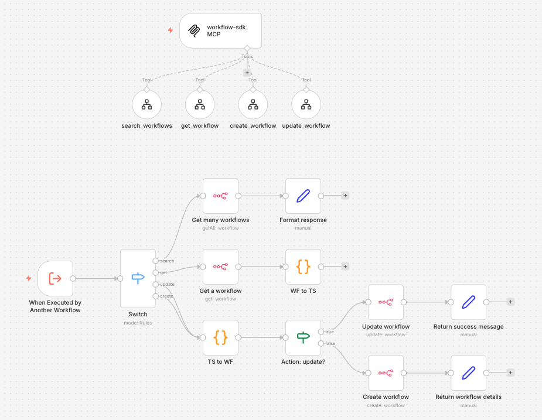

# n8n workflow-sdk MCP



A template for managing n8n workflows programmatically using Claude Code — with an MCP server workflow that lets Claude read and update your n8n workflows directly, using TypeScript as the authoring language.

This template is designed to be used together with the **[n8n-workflow-sdk Claude Code skill](https://github.com/geckse/n8n-skills/)**, which teaches Claude the full SDK API, correct node patterns, and validation guidance for authoring n8n workflows in TypeScript.

## What This Is

This template gives you:

- **Claude Code project instructions** (`CLAUDE.md`) — teaches Claude the TypeScript workflow conventions, known SDK quirks, and how to interact with your n8n instance via MCP
- **An n8n MCP server workflow** (`n8n-workflow/`) — a workflow you import into n8n that exposes `search_workflows`, `get_workflow`, `create_workflow`, and `update_workflow` tools to Claude via MCP
- **Playwright browser integration** — after every workflow create or update, Claude opens the workflow in your browser. You can also ask Claude to visually inspect the canvas at any point.
- **A repeatable pattern** for AI-assisted workflow authoring, modification, and deployment

### How the SDK fits in

The [`@n8n/workflow-sdk`](https://www.npmjs.com/package/@n8n/workflow-sdk) is **not** something you install locally. It lives inside the MCP server workflow itself, embedded in Code nodes:

- **`search_workflows`** — searches workflows by name and returns a list with IDs and metadata
- **`get_workflow`** — retrieves a workflow's JSON from n8n and uses the SDK to convert it to TypeScript, which is returned to Claude
- **`create_workflow`** — receives TypeScript from Claude, converts it to n8n JSON using the SDK, and creates a new workflow
- **`update_workflow`** — receives TypeScript from Claude, uses the SDK to parse it back to n8n JSON, and pushes the update to an existing workflow

Claude works entirely in TypeScript and never deals with raw n8n JSON. The conversion happens transparently inside the n8n workflow.

## Prerequisites

- [Claude Code](https://claude.ai/claude-code) installed
- An n8n instance (self-hosted) **version 2.9.0 or higher**
- The following environment variable set on your n8n instance to allow the SDK to be used inside Code nodes:
  ```
  NODE_FUNCTION_ALLOW_EXTERNAL="@n8n/workflow-sdk"
  ```
- The **[n8n-workflow-sdk skill](https://github.com/geckse/n8n-skills/)** installed in Claude Code (see step 8)

## Setup

### 1. Clone this repository

Clone this repository and navigate into the cloned folder in a terminal.

### 2. Configure your n8n instance

Add the following environment variable to your n8n instance and restart it:

```
NODE_FUNCTION_ALLOW_EXTERNAL="@n8n/workflow-sdk"
```

### 3. Import and publish the MCP workflow

Import `n8n-workflow/n8n workflow-sdk MCP.json` into your n8n instance and publish it.

### 4. Register the MCP server with Claude Code

Open the **MCP Trigger** node, copy the **Production URL**, and run the following in your terminal from inside the cloned repository folder:

```bash
claude mcp add --transport sse n8n-workflows <paste-production-url-here>
```

### 5. Install the Playwright MCP server

In the same terminal, run:

```bash
claude mcp add playwright-mcp npx @executeautomation/playwright-mcp-server
```

### 6. Update CLAUDE.md

Replace all occurrences of `https://your-n8n-instance.com/` with your n8n base URL (appears twice).

### 7. Open Claude Code

From inside the cloned repository folder, open Claude Code. All MCP servers will now be available from the start.

### 8. Install the n8n-workflow-sdk skill

👉 **[Install the n8n-workflow-sdk skill here](https://github.com/geckse/n8n-skills/)** and follow the installation instructions.

Close and reopen Claude Code afterwards so the skill is fully loaded.

## How It Works

Once set up, just talk to Claude Code naturally. You can be as specific or as hands-off as you like — Claude handles the rest.

**Delegate everything in one go:**
> "Find the workflow called 'Invoice Processor' and replace the manual trigger with a webhook."

Claude will search for it, retrieve it, make the change, push it back, and open it in the browser.

**Or go step by step:**

1. **Search** — ask Claude to find a workflow by name. It returns a list with names and IDs so you can pick the right one.
2. **Retrieve & inspect** — Claude fetches the workflow as TypeScript. You can ask Claude to explain it, review it, or suggest improvements before touching anything.
3. **Modify** — tell Claude what to change: swap a node, add a step, update credentials, rewire connections. Claude edits the TypeScript accordingly.
4. **Push** — Claude sends the updated workflow back to n8n automatically.
5. **Review** — Claude opens the workflow in your browser. You can also ask Claude to take a look at the canvas and give feedback.

You can also ask Claude to **create a brand-new workflow** from scratch — just describe what it should do.

There's no right or wrong way to use it. You stay in control of how much you delegate.
